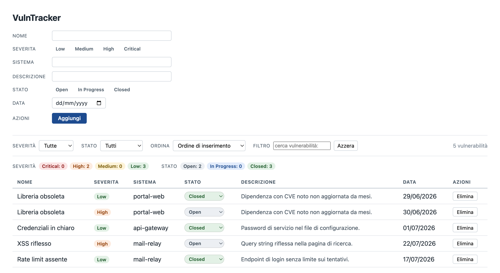

# VulnTracker

Applicazione web per il tracciamento delle vulnerabilità di sicurezza: registra le vulnerabilità trovate sui tuoi sistemi, ne segui lo stato di risoluzione e le filtri per gravità.

Tutto in HTML, CSS e JavaScript puro — nessuna dipendenza, nessun build, nessun server. I dati restano nel browser tramite `localStorage`.

## Preview



## Funzionalità

- **Inserimento** — form per aggiungere una vulnerabilità con nome, severità, sistema, descrizione, stato e data, con validazione dei campi obbligatori.
- **Tabella** — elenco delle vulnerabilità con badge colorati per la severità.
- **Cambio stato** — tendina su ogni riga per passare da `Open` a `In Progress` a `Closed`, con salvataggio immediato.
- **Eliminazione** — rimozione di una singola vulnerabilità.
- **Filtri combinabili** — per severità, per stato e ricerca testuale su nome e sistema: si applicano insieme.
- **Ordinamento** — per gravità reale (`Critical` → `Low` o viceversa), non alfabetica.
- **Conteggi** — quante vulnerabilità ci sono per ogni severità e per ogni stato, aggiornati a ogni modifica.
- **Persistenza** — i dati sopravvivono alla chiusura del browser.

## Come si usa

Apri `index.html` nel browser. Non serve altro.

Al primo avvio, non trovando dati salvati, l'app genera 5 vulnerabilità di esempio per mostrare l'interfaccia popolata. Da quel momento lavori sui tuoi dati.

> **Nota:** aprendo il file con doppio clic (`file://`) alcuni browser bloccano `localStorage`. In quel caso l'app funziona ma non salva nulla tra un refresh e l'altro, e la console lo segnala. Per evitarlo, servi la cartella con un server locale, per esempio `python3 -m http.server` e poi apri `http://localhost:8000`.

## Formato dei dati

Ogni vulnerabilità è un oggetto con questa forma:

```js
{
  id:          "1700000000000",   // timestamp come stringa
  nome:        "SQL Injection",
  severita:    "Critical",        // Critical | High | Medium | Low
  sistema:     "login-service",
  stato:       "Open",            // Open | In Progress | Closed
  descrizione: "Parametro non sanitizzato nel form login.",
  data:        "13/08/2026"       // gg/mm/aaaa
}
```

L'elenco completo è salvato come array JSON nella chiave `vulntracker_data` di `localStorage`.

Per ripartire da zero, in console:

```js
localStorage.removeItem('vulntracker_data');
```

## Struttura del progetto

| File | Contenuto |
|---|---|
| `index.html` | struttura della pagina: form di inserimento, barra dei filtri, conteggi, tabella |
| `app.js` | rendering della tabella, filtri e ordinamento, form, conteggi, lettura e scrittura su `localStorage` |
| `style.css` | stile, con i colori di severità e stato condivisi tra badge, tendine e conteggi |
| `preview.png` | screenshot usato in questo README |

I valori ammessi vivono in cima ad `app.js` nelle costanti `SEVERITA` e `STATI`: da lì alimentano le tendine dei filtri, quella dello stato e la validazione.

## Autori

- **Carlos Torres Paredes** — [@yoCarlis](https://github.com/yoCarlis)
- **Beatrice Follia** — [@tr1xy0](https://github.com/tr1xy0)
